# Feature: Deploy-Time Modularity - Level 1 (External Provider Injection)

**Status**: Draft
**Created**: 2025-11-12
**Priority**: P1
**Depends on**: lls-preflight-spec.md (provider validation before server start)

## Purpose

Enable llama-stack Kubernetes operator users to integrate custom and third-party provider implementations at deployment time without rebuilding distribution container images. This empowers platform engineers and ISV partners to extend llama-stack functionality through a standardized provider packaging and injection mechanism.

## User Scenarios & Testing

### User Story 1 - Deploy Custom Provider (Priority: P1)

As a platform engineer, I want to deploy a llama-stack instance with my organization's custom vLLM provider without building a custom distribution image, so that I can maintain separation between the base platform and our custom integrations.

**Why this priority**: Core value proposition - enables the primary use case of custom provider integration.

**Independent Test**: Can be fully tested by deploying a LLSD CR with one external provider and verifying the provider appears in the `/v1/providers` API endpoint and is functional.

**Acceptance Scenarios**:

1. **Given** a provider packaged as a container image with valid metadata, **When** I reference it in the LLSD `externalProviders` field, **Then** the provider is installed and available via the llama-stack API
2. **Given** multiple external providers for different APIs, **When** I deploy the LLSD, **Then** all providers are installed in deterministic order and functional
3. **Given** a provider image with dependency conflicts, **When** I deploy the LLSD, **Then** the deployment fails with a clear error message identifying the conflicting packages and provider images

### User Story 2 - Override Distribution Providers (Priority: P2)

As a platform operator, I want to replace a provider from the base distribution with my custom implementation while keeping the same provider ID, so that I can customize functionality without changing application code.

**Why this priority**: Enables customization of existing deployments - important for production flexibility.

**Independent Test**: Deploy LLSD with base distribution, then add external provider with same ID as distribution provider, verify external provider takes precedence.

**Acceptance Scenarios**:

1. **Given** a base distribution with provider ID "vllm-inference", **When** I add an external provider with the same ID, **Then** the external provider configuration overrides the base provider with a warning logged
2. **Given** a user-provided ConfigMap defining providers, **When** I add external providers with conflicting IDs, **Then** external providers take precedence with warnings logged

### User Story 3 - Diagnose Provider Failures (Priority: P2)

As a developer debugging a failed deployment, I need clear error messages when provider installation fails, so that I can quickly identify and fix the root cause.

**Why this priority**: Critical for usability and reducing time-to-resolution for deployment issues.

**Independent Test**: Trigger various failure scenarios (missing metadata, dependency conflicts, API mismatches) and verify clear, actionable error messages appear in LLSD status.

**Acceptance Scenarios**:

1. **Given** a provider image missing `lls-provider-spec.yaml`, **When** the init container runs, **Then** the LLSD status shows "Missing /lls-provider/lls-provider-spec.yaml in image {image}" with init container name
2. **Given** two providers with conflicting dependencies, **When** installation fails, **Then** the error message identifies the failing provider and conflicting packages with reference to installed-packages.txt
3. **Given** a provider declaring api=inference but placed under externalProviders.safety, **When** validation runs, **Then** the error clearly states the mismatch and suggests moving to the correct API section
4. **Given** a provider image with imagePullBackOff error, **When** the pod fails to start, **Then** the LLSD status shows "Failed to pull provider image {image}" with clear message about image pull credentials
5. **Given** a provider with invalid YAML in lls-provider-spec.yaml, **When** the init container parses metadata, **Then** the error message shows the YAML parse error with line number
6. **Given** a provider wheel file that fails pip install, **When** installation runs, **Then** the error includes pip's output and suggests checking wheel compatibility
7. **Given** distribution image with no run.yaml at known paths, **When** config extraction runs, **Then** the init container fails with error indicating missing run.yaml and suggesting to provide user ConfigMap
8. **Given** two external providers with duplicate providerId, **When** merge runs, **Then** the merge container fails with error listing both provider images and the duplicate ID

### Edge Cases

- **Provider image updated while LLSD running**:
  - What: Provider image is updated (new tag) while LLSD is running
  - Expected: Rolling update triggered, new init containers run, provider updated

- **Provider metadata differs from runtime spec**:
  - What: Provider metadata fields differ from get_provider_spec()
  - Expected: Warning logged for each mismatched field, runtime values from get_provider_spec() used, deployment continues

- **Duplicate provider IDs in external providers**:
  - What: Two external providers declare the same providerId
  - Expected: Deployment fails immediately with error listing both images and the duplicate ID

- **External provider packages override base packages**:
  - What: External provider packages override base Python packages
  - Expected: External provider packages take precedence (PYTHONPATH ordering)

- **Provider native code architecture mismatch**:
  - What: Provider has native code compiled for wrong architecture
  - Expected: Preflight detects architecture mismatch before import, deployment fails with clear error

## Requirements

### Functional Requirements

#### Provider Image Contract

- **FR-001**: Provider images MUST contain a metadata file at `/lls-provider/lls-provider-spec.yaml`
- **FR-002**: Provider images MUST contain Python wheel packages in `/lls-provider/packages/` directory
- **FR-003**: The metadata file MUST be valid YAML conforming to the ProviderPackage schema (see File Formats section)
- **FR-004**: Provider packages MUST include all dependencies (no network access during installation)
- **FR-005**: Provider packages MUST implement `get_provider_spec()` function returning ProviderSpec matching metadata

#### CRD API Contract

- **FR-006**: LLSD CRD MUST add `externalProviders` field to `ServerSpec` structure
- **FR-007**: `externalProviders` MUST organize providers by API type (inference, safety, agents, etc.) matching run.yaml structure
- **FR-008**: Each external provider reference MUST include: providerId (unique instance name), image (container image reference), optional config (provider-specific JSON)
- **FR-009**: `providerId` MUST be unique across all providers (inline, remote, and external)
- **FR-010**: The CRD MUST NOT include `providerType` field - this is declared by the provider image metadata

#### Provider Installation

- **FR-011**: One Kubernetes init container MUST be created per external provider
- **FR-012**: Init containers MUST be created and executed in the order specified in the CRD (preserves user-defined order within each API section)
- **FR-013**: Init containers MUST install provider wheels to a shared volume accessible by the main container
- **FR-014**: Init containers MUST copy provider metadata to a shared location for operator access
- **FR-015**: Init containers MUST fail immediately if wheels cannot be installed
- **FR-016**: The main container MUST have external provider packages available before llama-stack server starts

#### Configuration Merging

- **FR-017**: The operator MUST generate run.yaml by merging (in order): user ConfigMap run.yaml (if exists) → external providers (using extra-providers.yaml schema)
- **FR-018**: When the same providerId appears in multiple sources, external providers MUST take precedence
- **FR-019**: When external provider overrides existing providerId, a WARNING MUST be logged with details
- **FR-020**: When two external providers declare the same providerId, deployment MUST fail with error listing both images
- **FR-021**: Provider `providerType` and `module` fields MUST come from provider image metadata, not CRD
- **FR-022**: Provider `config` field MUST come from CRD (user-provided configuration)

#### Validation

- **FR-023**: The operator MUST validate that provider image's declared API type matches the CRD section it's placed in
- **FR-024**: Dependency conflicts during pip install MUST cause init container failure with pip's error output captured in container logs and LLSD status
- **FR-024a**: Each init container MUST record which packages it installed (package name and version) to a shared manifest file for troubleshooting
- **FR-025**: Metadata file missing or invalid MUST cause init container failure
- **FR-026**: ALL overlapping fields between lls-provider-spec.yaml and get_provider_spec() MUST be compared; mismatches MUST log warnings but continue deployment (see "Metadata Field Comparison" for complete list)
- **FR-027**: Provider validation MUST occur before llama-stack server starts using `llama-stack preflight` command (see lls-preflight-spec.md for architecture, import, and spec validation)

#### Status Reporting

- **FR-028**: LLSD status MUST track each external provider's installation phase (Pending, Installing, Ready, Failed)
- **FR-029**: Init container failures MUST be reflected in LLSD status with error details
- **FR-030**: Error messages MUST include: provider ID, image reference, init container name, failure reason
- **FR-031**: Dependency conflict errors MUST include: the failing provider ID/image, conflicting package names and versions from pip's error output, and reference to the installation manifest for troubleshooting
- **FR-032**: API placement errors MUST clearly state: declared API vs placement location and suggest correction

### Non-Functional Requirements

- **NFR-001**: Init containers MUST NOT download dependencies from external networks
- **NFR-002**: Provider installation MUST be deterministic (same inputs = same outputs)
- **NFR-003**: Error messages MUST be actionable (user can resolve without operator knowledge)
- **NFR-004**: External provider packages MUST take precedence over base packages (PYTHONPATH ordering)
- **NFR-005**: Metadata validation warnings MUST be non-blocking (deployment continues)

### Key Entities

- **ExternalProviderRef**: References a provider container image with providerId, image, optional config
- **ProviderPackage**: Metadata structure in lls-provider-spec.yaml describing provider package
- **ExternalProviderStatus**: Status tracking for individual provider installation

## File Formats

### Provider Metadata File: `lls-provider-spec.yaml`

**Location**: `/lls-provider/lls-provider-spec.yaml` (inside provider image)

**Schema**:
```yaml
apiVersion: llamastack.io/v1alpha1
kind: ProviderPackage

metadata:
  name: string              # REQUIRED: Package identifier
  version: string           # REQUIRED: Semantic version
  vendor: string           # REQUIRED: Organization identifier
  description: string      # OPTIONAL: Human-readable description
  maintainer: string       # OPTIONAL: Contact email

spec:
  packageName: string      # REQUIRED: Python module path (e.g., "my_org.custom_vllm")
                          # LlamaStack imports this using importlib.import_module()
                          # and calls get_provider_impl() or get_adapter_impl()
  providerType: string     # REQUIRED: Provider type (e.g., "remote::custom-vllm")
  api: string              # REQUIRED: API name (e.g., "inference")
  wheelPath: string        # REQUIRED: Path to main wheel file
  dependencyWheels: array  # OPTIONAL: Paths to dependency wheels
```

**Validation Rules**:
- `apiVersion` MUST be `llamastack.io/v1alpha1`
- `kind` MUST be `ProviderPackage`
- `spec.packageName` MUST be valid Python module identifier (e.g., "my_org.vllm_provider") and the module MUST be importable after wheel installation
- `spec.providerType` MUST match pattern `(remote|inline)::[a-z0-9-]+`
- `spec.api` MUST be valid llama-stack API (inference, safety, agents, etc.)
- `spec.wheelPath` MUST point to existing file in image

### Metadata Field Comparison

During preflight validation (Phase 4), fields that appear in both `lls-provider-spec.yaml` and the runtime `get_provider_spec()` output are compared. Mismatches generate warnings but do not fail deployment.

**Overlapping Fields** (compared during validation):

| Field Name | Metadata Location | Runtime Location | Comparison Rule |
|---|---|---|---|
| `provider_type` | `spec.providerType` | `ProviderSpec.provider_type` | String equality (case-sensitive) |
| `api` | `spec.api` | `ProviderSpec.api` | String equality (case-sensitive) |

**Non-Overlapping Fields** (not compared):

| Field Name | Only in Metadata | Only in Runtime | Notes |
|---|---|---|---|
| `packageName` | ✓ | | Module path for import (not in ProviderSpec) |
| `wheelPath` | ✓ | | Installation detail (not in ProviderSpec) |
| `dependencyWheels` | ✓ | | Installation detail (not in ProviderSpec) |
| `config_schema` | | ✓ | Runtime schema (not in metadata) |
| `description` | Metadata only | May exist in runtime | Not compared (informational only) |

**Comparison Behavior**:
- For each overlapping field, compare metadata value to runtime value
- If values match → No action
- If values differ → Log warning with both values, use runtime value
- Runtime value always takes precedence (used by llama-stack server)

**Warning Format** (from lls-preflight-spec.md):
```
WARNING: Provider metadata mismatch (non-blocking)

Provider: custom-vllm

Field: provider_type
  Metadata (lls-provider-spec.yaml): remote::custom-vllm
  Runtime (get_provider_spec()): remote::vllm-v2
  Using: remote::vllm-v2 (runtime value)

Field: api
  Metadata (lls-provider-spec.yaml): inference
  Runtime (get_provider_spec()): inference
  Match ✓
```

**Future Extensibility**:
- If LlamaStack adds new fields to ProviderSpec that also appear in metadata, they should be added to the comparison list
- Comparison logic is in llama-stack preflight command, not operator

### CRD Structure

```go
type ServerSpec struct {
    // ... existing fields ...
    ExternalProviders *ExternalProvidersSpec `json:"externalProviders,omitempty"`
}

type ExternalProvidersSpec struct {
    Inference    []ExternalProviderRef `json:"inference,omitempty"`
    Safety       []ExternalProviderRef `json:"safety,omitempty"`
    Agents       []ExternalProviderRef `json:"agents,omitempty"`
    VectorIO     []ExternalProviderRef `json:"vectorIo,omitempty"`
    DatasetIO    []ExternalProviderRef `json:"datasetIo,omitempty"`
    Scoring      []ExternalProviderRef `json:"scoring,omitempty"`
    Eval         []ExternalProviderRef `json:"eval,omitempty"`
    ToolRuntime  []ExternalProviderRef `json:"toolRuntime,omitempty"`
    PostTraining []ExternalProviderRef `json:"postTraining,omitempty"`
}

type ExternalProviderRef struct {
    ProviderID      string                   `json:"providerId"`
    Image           string                   `json:"image"`
    // +kubebuilder:default:=IfNotPresent
    // +kubebuilder:validation:Enum=Always;Never;IfNotPresent
    ImagePullPolicy corev1.PullPolicy        `json:"imagePullPolicy,omitempty"`
    Config          *apiextensionsv1.JSON    `json:"config,omitempty"`
}

type ExternalProviderStatus struct {
    ProviderID         string      `json:"providerId"`
    Image              string      `json:"image"`
    Phase              string      `json:"phase"` // Pending, Installing, Ready, Failed
    Message            string      `json:"message,omitempty"`
    InitContainerName  string      `json:"initContainerName,omitempty"`
    LastTransitionTime metav1.Time `json:"lastTransitionTime,omitempty"`
}
```

## Behavioral Contracts

### Merge Order and Precedence

The operator MUST merge configurations in this order (later overrides earlier):

1. **Base run.yaml** from distribution image (if exists)
2. **User ConfigMap run.yaml** (if `spec.server.userConfig.configMapName` specified - completely replaces base)
3. **External providers** from `spec.server.externalProviders` (merged into providers section)

**Provider ID Conflict Resolution**:
- External provider vs ConfigMap/Distribution: External provider wins (with WARNING logged)
- Two external providers with same ID: Deployment FAILS (with error listing both)

### Configuration Merge Algorithm

The merge process combines base configuration (from distribution or user ConfigMap) with external provider definitions using provider ID-based override semantics.

**Inputs**:
- Base run.yaml (from distribution default or user ConfigMap)
- External provider metadata (from provider images + CRD configuration)

**Outputs**:
- Final merged run.yaml
- Warnings log for any provider ID conflicts

**Merge Behavior**:

1. **Start with base configuration**: Load the base run.yaml as the foundation

2. **Process each external provider**:
   - Identify the target API section (e.g., inference, safety, agents)
   - Create the API section if it doesn't exist in base config
   - Check if a provider with the same `provider_id` already exists in that API section
   - If duplicate found:
     - Remove the existing provider from base config
     - Log warning with details (provider ID, API, both provider types)
     - Add external provider to the API section
   - If no duplicate:
     - Add external provider to the API section

3. **Preserve order**: External providers are added in the order they appear in the CRD

4. **Generate warnings**: For each override, log warning containing:
   - Provider ID being overridden
   - API section
   - Base provider type vs external provider type
   - Indication that external provider is used

**Example**:

Given base config with provider ID "ollama":
```yaml
providers:
  inference:
    - provider_id: "ollama"
      provider_type: "remote::ollama"
      config: {url: "http://ollama:11434"}
```

And external providers:
- Provider ID "custom-vllm" (new)
- Provider ID "ollama" (conflicts with base)

Result:
```yaml
providers:
  inference:
    - provider_id: "custom-vllm"      # Added from external
      provider_type: "remote::vllm"
      module: "custom_vllm.provider"
      config: {url: "http://vllm:8000"}
    - provider_id: "ollama"            # Replaced base provider
      provider_type: "remote::ollama-custom"
      module: "custom_ollama.provider"
      config: {url: "http://custom-ollama:11434"}
```

Warning generated:
```
External provider 'ollama' overrides base provider in API 'inference'
  Base type: remote::ollama
  External type: remote::ollama-custom
```

**Edge Cases**:
- Empty base config → Create providers section, add external providers
- New API type not in base → Create API section, add external providers
- External provider with no config → Omit config field in output
- Base provider section empty → External providers become the only providers

### Validation Rules

**Init Container Phase**:
- Metadata file MUST exist → Fail if missing
- Metadata file MUST be valid YAML → Fail if invalid
- Package directory MUST exist → Fail if missing
- All wheels MUST install successfully → Fail on pip install error

**Reconciliation Phase**:
- No duplicate provider IDs in external providers → Fail if duplicates found
- Provider metadata API MUST match CRD API section → Fail if mismatch

**Preflight Phase** (executed before llama-stack server starts - see lls-preflight-spec.md):
- Native code architecture MUST match runtime platform → Fail if mismatch (checked before import)
- All provider modules MUST be importable → Fail if import error (optional dependencies in try/except allowed)
- get_provider_spec() MUST return valid ProviderSpec → Fail if invalid
- ALL overlapping metadata fields SHOULD match get_provider_spec() → Warn for each mismatch, use runtime value

### Error Message Requirements

All error messages MUST include:
- **Provider ID**: User-assigned instance identifier
- **Image reference**: Full container image path
- **Context**: What operation failed and why
- **Resolution**: Actionable steps to fix

**Dependency Conflict Error Format**:
```
ERROR: Cannot install provider '{providerId}' due to dependency conflict

Provider: {providerId}
Image: {image}
Init Container: {initContainerName}

Pip installation failed with:
{pip error output showing version conflict}

Previously installed packages can be found in: /opt/llama-stack/external-providers/installed-packages.txt

Resolution: Update provider images to use compatible dependency versions, or reorder providers in the CRD if one provider's dependencies are a superset of another's.
```

**API Placement Error Format**:
```
ERROR: Provider API type mismatch

Provider '{providerId}' (image: {image})
declares api={declaredAPI} in lls-provider-spec.yaml
but is placed under externalProviders.{placementAPI}

Resolution: Move the provider to externalProviders.{declaredAPI} section in the LLSD spec.
```

**Terminology Note - "Phase" Usage**: This specification uses "phase" in three contexts:
- **Runtime Phases** (this section): Sequential steps in Pod startup lifecycle (Phase 1-5: Provider Install → Config Extract → Merge → Preflight → Server Start)
- **Implementation Phases** (plan.md): Development sequence for building components (Phase 0-6: CRD → Metadata → Init → Merge → Controller → Status → Testing)
- **Task Phases** (tasks.md): User story grouping for parallel execution (Phase 1-7: Setup → Foundation → US1 → US2 → US3 → Edge Cases → Polish)

These represent different perspectives on the same feature and don't conflict.

### Container Startup Sequence

This section describes the complete Pod startup flow when external providers are configured.

**Startup Flow Diagram**:

```mermaid
flowchart TD
    Start([Pod Created]) --> P1A[Init Container 1: Provider A]
    P1A -->|Install wheels| P1A1[Write to /opt/llama-stack/external-providers/python-packages]
    P1A1 --> P1A2[Write metadata to /opt/llama-stack/external-providers/metadata/providerA/]
    P1A2 --> P1A3[Append to installed-packages.txt]
    P1A3 -->|Success| P1B[Init Container 2: Provider B]

    P1B -->|Install wheels| P1B1[Write to /opt/llama-stack/external-providers/python-packages]
    P1B1 --> P1B2[Write metadata to /opt/llama-stack/external-providers/metadata/providerB/]
    P1B2 --> P1B3[Append to installed-packages.txt]
    P1B3 -->|Success| P2{User ConfigMap<br/>specified?}

    P2 -->|No| P2A[Init Container: Extract Config]
    P2A --> P2A1[Try /opt/app-root/run.yaml]
    P2A1 -->|Found| P2A2[Copy to /opt/llama-stack/base-config/run.yaml]
    P2A1 -->|Not found| P2A3[Try /etc/llama-stack/run.yaml]
    P2A3 -->|Found| P2A2
    P2A3 -->|Not found| Fail5[Pod Fails:<br/>No run.yaml in distribution image]
    P2A2 --> P3

    P2 -->|Yes| P2B[Mount ConfigMap at<br/>/opt/llama-stack/base-config/run.yaml]
    P2B --> P3

    P3[Init Container: Merge Config] --> P3A[Scan /opt/llama-stack/external-providers/metadata/]
    P3A --> P3B[Read lls-provider-spec.yaml + crd-config.yaml<br/>for each provider]
    P3B --> P3C[Generate extra-providers.yaml]
    P3C --> P3D[Merge with base run.yaml]
    P3D --> P3E[Write final run.yaml to<br/>/opt/llama-stack/config/run.yaml]
    P3E -->|Success| P4

    P4[Main Container Starts] --> P4A[Set PYTHONPATH]
    P4A --> P4B[Run: llama-stack preflight<br/>--run-yaml=/opt/llama-stack/config/run.yaml]
    P4B -->|Exit 0| P5
    P4B -->|Exit ≠ 0| Fail1[Container Fails:<br/>Preflight validation error]

    P5[Start Server] --> P5A[Run: llama stack run<br/>/opt/llama-stack/config/run.yaml]
    P5A --> P5B[Load providers from config]
    P5B --> P5C[Server Ready:<br/>Providers available via /v1/providers API]
    P5C --> Success([Pod Running])

    P1A3 -->|Failure| Fail2[Pod Fails:<br/>Provider installation error]
    P1B3 -->|Failure| Fail2
    P3E -->|Failure| Fail3[Pod Fails:<br/>Config merge error]
    P5A -->|Failure| Fail4[Pod Fails:<br/>Server startup error]

    style Start fill:#e1f5e1
    style Success fill:#e1f5e1
    style Fail1 fill:#ffe1e1
    style Fail2 fill:#ffe1e1
    style Fail3 fill:#ffe1e1
    style Fail4 fill:#ffe1e1
    style Fail5 fill:#ffe1e1
    style P1A fill:#e3f2fd
    style P1B fill:#e3f2fd
    style P2A fill:#fff3e0
    style P3 fill:#f3e5f5
    style P4 fill:#e8f5e9
    style P5 fill:#e8f5e9
```



**Legend**:
- 🔵 Blue: Provider installation init containers (one per external provider)
- 🟠 Orange: Config extraction init container (conditional)
- 🟣 Purple: Merge init container
- 🟢 Green: Main container execution
- 🔴 Red: Failure states

**Phase 1: Provider Installation (Init Containers)**

For each external provider in CRD order:
1. Init container starts using provider image
2. Validates `/lls-provider/lls-provider-spec.yaml` exists and is valid YAML
3. Installs wheel packages from `/lls-provider/packages/` to shared volume: `/opt/llama-stack/external-providers/python-packages`
4. Records installed packages to: `/opt/llama-stack/external-providers/installed-packages.txt` (append mode)
5. Copies metadata file to: `/opt/llama-stack/external-providers/metadata/{providerId}/lls-provider-spec.yaml`
6. Writes CRD-provided config to: `/opt/llama-stack/external-providers/metadata/{providerId}/crd-config.yaml` containing:
   - `providerId`: instance name
   - `api`: API section from CRD (inference, safety, etc.)
   - `config`: provider-specific configuration JSON from CRD
7. On success: Next init container starts
8. On failure: Pod fails, LLSD status updated with error details

**Phase 2: Extract Base Configuration (Init Container - Conditional)**

This phase only runs when NO user ConfigMap is specified in CRD:
1. Init container starts using **distribution image** (same as main container)
2. Searches for distribution's default run.yaml in known paths:
   - `/opt/app-root/run.yaml` (newer distributions)
   - `/etc/llama-stack/run.yaml` (legacy path)
3. If found, copies run.yaml to: `/opt/llama-stack/base-config/run.yaml` on shared volume
4. If neither path exists: **FAILS** with error indicating distribution doesn't contain run.yaml
5. On success: Proceeds to Phase 3

**Note**: If user ConfigMap is specified, this phase is skipped and the ConfigMap is mounted directly at `/opt/llama-stack/base-config/run.yaml`.

**Phase 3: Configuration Merge (Init Container)**

After all provider init containers and optional config extraction complete:
1. Merge init container starts (uses operator's own image, detected via Downward API - see "Merge Init Container Specification")
2. Reads base configuration from: `/opt/llama-stack/base-config/run.yaml` (from ConfigMap mount OR extracted in Phase 2)
3. Scans external provider metadata directory: `/opt/llama-stack/external-providers/metadata/`
4. For each provider directory, reads:
   - `lls-provider-spec.yaml` (provider type, module, api)
   - `crd-config.yaml` (providerId, api section, user config)
5. Generates `extra-providers.yaml` from combined metadata
6. Merges configurations (see "Merge Order and Precedence" and "Configuration Merge Algorithm" sections)
7. Writes final run.yaml to: `/opt/llama-stack/config/run.yaml`
8. On success: Main container starts
9. On failure: Pod fails with merge error details

**Phase 4: Preflight Validation (Main Container Startup)**

Main container starts, before llama-stack server:
1. Environment variable `PYTHONPATH` prepended with: `/opt/llama-stack/external-providers/python-packages`
2. Preflight validation runs: `llama-stack preflight --run-yaml=/opt/llama-stack/config/run.yaml`
3. Preflight validates (see lls-preflight-spec.md):
   - Architecture compatibility (native extensions match platform)
   - Provider module imports successfully
   - `get_provider_spec()` returns valid ProviderSpec
   - Metadata consistency (warnings only for mismatches)
4. On preflight success (exit code 0): Continue to Phase 5
5. On preflight failure (exit code ≠ 0): Container fails, error logged to LLSD status

**Phase 5: Server Start**

After preflight succeeds:
1. llama-stack server starts: `llama stack run /opt/llama-stack/config/run.yaml`
2. Server loads providers from merged configuration
3. External providers available via API: `/v1/providers`
4. Pod transitions to Running, LLSD status updated to Ready

**Failure Handling**:
- Any phase failure prevents subsequent phases from starting
- Init container failures: LLSD status shows which provider failed in `externalProviders` status array
- Merge failures: LLSD status shows configuration merge error
- Preflight failures: LLSD status shows which provider validation failed
- Server failures: Standard Kubernetes restart policy applies

### Extra Providers Configuration: `extra-providers.yaml`

**Purpose**: Forward-compatible schema for external provider definitions

**Location**: Generated by merge init container from provider metadata

**Schema**:
```yaml
apiVersion: llamastack.io/v1alpha1
kind: ExternalProviders

providers:
  <api-type>:  # One of: inference, safety, agents, vector_io, datasetio, scoring, eval, tool_runtime, post_training
    - provider_id: string       # REQUIRED: Unique instance identifier
      provider_type: string     # REQUIRED: Provider type (from metadata)
      module: string            # REQUIRED: Python module path (from metadata)
      config: object            # OPTIONAL: Provider-specific configuration (from CRD)
```

**Field Mapping**:
| Field | Source | Description |
|-------|--------|-------------|
| `provider_id` | CRD `externalProviders.<api>.<n>.providerId` | User-assigned unique identifier |
| `provider_type` | Provider metadata `spec.providerType` | Provider type (e.g., "remote::vllm") |
| `module` | Provider metadata `spec.packageName` | Python module path for import |
| `config` | CRD `externalProviders.<api>.<n>.config` | Provider-specific configuration |

**Why this schema**:
- Matches run.yaml provider structure exactly
- Forward-compatible with future LlamaStack native support
- Enables clean separation of base vs external providers

## User-Facing Paths and Environment Variables

### Paths in Provider Image
- `/lls-provider/` - Top-level provider directory
- `/lls-provider/lls-provider-spec.yaml` - Provider metadata (REQUIRED)
- `/lls-provider/packages/` - Directory containing wheel files (REQUIRED)
- `/lls-provider/packages/*.whl` - Python wheel files

### Paths in Main Container
- `/opt/llama-stack/external-providers` - Mount point for shared volume
- `/opt/llama-stack/external-providers/python-packages` - Installed provider packages
- `/opt/llama-stack/external-providers/metadata/{providerId}/` - Provider metadata directories
  - `lls-provider-spec.yaml` - Provider package metadata (from provider image)
  - `crd-config.yaml` - CRD-provided configuration (providerId, api, config)
- `/opt/llama-stack/external-providers/installed-packages.txt` - Record of installed packages
- `/opt/llama-stack/config/run.yaml` - Final merged configuration
- `/opt/llama-stack/config/extra-providers.yaml` - Generated external providers config

### Environment Variables
- `PYTHONPATH` - MUST be prepended with `/opt/llama-stack/external-providers/python-packages`

### Shared Volume Specification

External provider functionality requires a shared volume for passing provider packages, metadata, and configuration between init containers and the main container.

**Volume Type**: `emptyDir` (ephemeral, pod-scoped)

**Rationale for emptyDir**:
- Provider packages are transient (reinstalled on each pod restart)
- No persistence needed across pod lifecycles
- Automatic cleanup when pod is deleted
- No external storage dependencies
- Fast local filesystem performance

**Volume Configuration**:
```yaml
volumes:
- name: external-providers
  emptyDir:
    sizeLimit: 2Gi  # Sufficient for typical provider packages
```

**Size Considerations**:
- Default limit: 2Gi (configurable via operator)
- Typical provider with dependencies: 100-500 MB
- Supports 4-20 providers comfortably
- If limit exceeded, pod evicted with clear error

**Mount Points**:

| Container Type | Path | Access Mode | Purpose |
|---|---|---|---|
| Provider init containers | `/opt/llama-stack/external-providers` | readWrite | Install packages, write metadata |
| Config extraction init | `/opt/llama-stack/base-config` | readWrite | Write extracted run.yaml |
| Merge init container | `/opt/llama-stack/external-providers` | readOnly | Read provider metadata |
| Merge init container | `/opt/llama-stack/base-config` | readOnly | Read base run.yaml |
| Merge init container | `/opt/llama-stack/config` | readWrite | Write merged run.yaml |
| Main container | `/opt/llama-stack/external-providers` | readOnly | Access installed packages |
| Main container | `/opt/llama-stack/config` | readOnly | Read final run.yaml |

**Directory Structure** (on shared volume):
```
/opt/llama-stack/
├── external-providers/
│   ├── python-packages/          # pip install target
│   │   ├── {package}/
│   │   └── {package}.dist-info/
│   ├── metadata/                 # Provider metadata
│   │   └── {providerId}/
│   │       ├── lls-provider-spec.yaml
│   │       └── crd-config.yaml
│   └── installed-packages.txt    # Installation log
├── base-config/
│   └── run.yaml                  # Extracted or mounted base config
└── config/
    ├── run.yaml                  # Final merged config
    ├── extra-providers.yaml      # Generated external providers
    └── merge-log.txt             # Merge operation log
```

**Lifecycle**:
1. Volume created when pod starts
2. Init containers populate volume sequentially
3. Main container consumes volume (read-only)
4. Volume deleted when pod terminates
5. On pod restart, volume recreated and repopulated

**Alternative Considered: Persistent Volume**
- **Rejected** because:
  - Adds complexity (PVC management, storage classes)
  - No benefit (packages reinstalled anyway on operator upgrades)
  - Potential for stale packages if image tags change
  - Storage quota implications for users

### Config Extraction Init Container Specification

This init container extracts the distribution's default run.yaml when no user ConfigMap is specified.

**When Added**:
- Only when `spec.server.userConfig.configMapName` is NOT specified
- Positioned after provider init containers, before merge init container
- If user ConfigMap exists, this container is skipped and ConfigMap is mounted instead

**Container Configuration**:
- **Name**: `extract-distribution-config`
- **Image**: Distribution image (same as `spec.image` from LLSD)
- **Command**: Shell script to find and copy run.yaml

**Command Logic**:
```bash
#!/bin/sh
set -e

# Try newer path first
if [ -f /opt/app-root/run.yaml ]; then
  echo "Found run.yaml at /opt/app-root/run.yaml"
  cp /opt/app-root/run.yaml /opt/llama-stack/base-config/run.yaml
  exit 0
fi

# Try legacy path
if [ -f /etc/llama-stack/run.yaml ]; then
  echo "Found run.yaml at /etc/llama-stack/run.yaml"
  cp /etc/llama-stack/run.yaml /opt/llama-stack/base-config/run.yaml
  exit 0
fi

# No run.yaml found - fail with error
echo "ERROR: No run.yaml found in distribution image"
echo "Checked paths:"
echo "  - /opt/app-root/run.yaml (not found)"
echo "  - /etc/llama-stack/run.yaml (not found)"
echo ""
echo "Resolution: Either provide a user ConfigMap with run.yaml or use a distribution image that includes run.yaml"
exit 1
```

**Volume Mounts**:
- Shared volume mounted at `/opt/llama-stack/base-config/` (readWrite)

**Exit Behavior**:
- Exits with code 0 if run.yaml is found and copied successfully
- Exits with code 1 if no run.yaml is found at known paths
- Pod fails with clear error message indicating missing run.yaml

**Rationale for Failure on Missing run.yaml**:
- Distribution images without run.yaml likely indicate misconfiguration
- Explicit failure is better than silent fallback to empty config
- Users must either provide user ConfigMap or use distribution with run.yaml
- Prevents confusing runtime errors from empty/incomplete configuration

**Future Compatibility**:
- When `--extra-providers` flag is available, this init container can be removed entirely
- External providers can be passed directly via flag without merging

### Merge Init Container Specification

The merge init container generates the final `run.yaml` configuration by combining base config with external provider definitions.

**Container Image Discovery**:

The operator uses its own image for the merge init container to avoid maintaining a separate image. The operator determines its image using the Kubernetes Downward API:

1. **Downward API injection** - Operator deployment includes:
   ```yaml
   env:
   - name: POD_NAME
     valueFrom:
       fieldRef:
         fieldPath: metadata.name
   - name: POD_NAMESPACE
     valueFrom:
       fieldRef:
         fieldPath: metadata.namespace
   - name: CONTAINER_NAME
     value: "manager"  # Operator's container name
   ```

2. **Image detection in reconciler** - During LLSD reconciliation:
   ```go
   // Fetch operator's own Pod
   operatorPod := &corev1.Pod{}
   err := r.Get(ctx, types.NamespacedName{
       Name:      os.Getenv("POD_NAME"),
       Namespace: os.Getenv("POD_NAMESPACE"),
   }, operatorPod)

   // Find operator's container by name and extract image
   operatorImage := ""
   containerName := os.Getenv("CONTAINER_NAME")
   for _, container := range operatorPod.Spec.Containers {
       if container.Name == containerName {
           operatorImage = container.Image
           break
       }
   }

   // Use operatorImage for merge init container
   ```

3. **RBAC requirements** - Operator ServiceAccount needs:
   ```yaml
   - apiGroups: [""]
     resources: ["pods"]
     verbs: ["get"]
   ```

**Container Configuration**:
- **Name**: `merge-config`
- **Image**: Operator's own image (detected via Downward API mechanism above)
- **Command**: `["/manager", "merge-config"]` (operator binary with merge subcommand)
- **Working Directory**: `/workspace`

**Inputs** (mounted volumes):
- `/opt/llama-stack/external-providers/metadata/` - Provider metadata directories (shared volume, readOnly)
- `/opt/llama-stack/base-config/run.yaml` - Base run.yaml (shared volume from Phase 2, OR ConfigMap mount if user-provided, readOnly)

**Outputs** (mounted volumes):
- `/opt/llama-stack/config/run.yaml` - Final merged configuration (shared volume, readWrite)
- `/opt/llama-stack/config/extra-providers.yaml` - Generated external providers file (shared volume, readWrite)
- `/opt/llama-stack/config/merge-log.txt` - Merge operation log with warnings (shared volume, readWrite)

**Merge Process**:

1. **Discover external providers**:
   - Scan `/opt/llama-stack/external-providers/metadata/` for subdirectories
   - For each directory `{providerId}/`:
     - Read `lls-provider-spec.yaml` → extract `providerType`, `packageName`, `api`
     - Read `crd-config.yaml` → extract `providerId`, `api` (CRD section), `config`
     - Validate that `lls-provider-spec.yaml` api matches `crd-config.yaml` api

2. **Check for duplicate providerIds**:
   - Collect all providerIds from metadata directories
   - If duplicates found → Fail with error listing duplicate IDs

3. **Load base configuration**:
   - Read `/opt/llama-stack/base-config/run.yaml`
   - Parse YAML into run.yaml structure

4. **Generate extra-providers.yaml**:
   - For each discovered provider, create entry:
     ```yaml
     providers:
       {api}:  # e.g., "inference"
         - provider_id: {providerId}
           provider_type: {providerType}
           module: {packageName}
           config: {config from crd-config.yaml}
     ```

5. **Merge configurations** (see "Configuration Merge Algorithm"):
   - Apply provider ID-based merge with external providers taking precedence
   - Log warnings for overridden providers to merge-log.txt

6. **Write outputs**:
   - Write final run.yaml to `/opt/llama-stack/config/run.yaml`
   - Write extra-providers.yaml to `/opt/llama-stack/config/extra-providers.yaml`
   - Write merge log to `/opt/llama-stack/config/merge-log.txt`

**Exit Codes**:
- `0`: Merge successful
- `1`: Merge failed (duplicate provider IDs, API mismatch, missing files, YAML parse errors)

**Error Handling**:
- Missing `lls-provider-spec.yaml` in provider directory → Fail with error
- Missing `crd-config.yaml` in provider directory → Fail with error
- API mismatch between lls-provider-spec.yaml and crd-config.yaml → Fail with error (FR-023 validation)
- Duplicate providerId in external providers → Fail with error
- Invalid YAML in base config → Fail with parse error
- Provider ID override (external vs ConfigMap provider) → Log warning, continue (external wins per FR-018)

**Future Compatibility**:

When LlamaStack adds native `--extra-providers` flag support, the merge init container can be simplified:
- **Keep**: Generation of `extra-providers.yaml` from metadata
- **Remove**: Merging logic (let LlamaStack handle it)
- **Change**: Main container args to: `llama stack run /etc/llama-stack/run.yaml --extra-providers /opt/llama-stack/config/extra-providers.yaml`
- **Remove**: Config extraction init container (not needed)

This clean migration path ensures the operator can easily adopt native LlamaStack support when available.

## Success Criteria

### Measurable Outcomes

- **SC-001**: Users can deploy LLSD with external providers without building custom images
- **SC-002**: Provider installation failures result in clear, actionable error messages in LLSD status
- **SC-003**: External providers appear in `/v1/providers` API endpoint with correct metadata
- **SC-004**: External providers are callable and functional through llama-stack API
- **SC-005**: Architecture mismatches are detected before server starts with clear error messages
- **SC-006**: Dependency conflicts are detected and reported before server starts
- **SC-007**: ALL overlapping metadata fields are compared; mismatches generate warnings but don't block deployment
- **SC-008**: Optional dependencies within provider modules are allowed (try/except pattern works)
- **SC-009**: 100% of external provider errors include provider ID, image, and resolution steps

## Dependencies

### Internal Dependencies

**Critical Dependency: llama-stack preflight command**
- **Requirement**: llama-stack CLI must implement `preflight` command for provider validation
- **Specification**: See lls-preflight-spec.md for detailed preflight requirements
- **Status**: Draft specification, not yet implemented in llama-stack
- **Risk Level**: **HIGH** - Blocking dependency for full Level 1 implementation

**Dependency Details**:
- FR-027 requires preflight validation before server starts
- Preflight validates: architecture compatibility, module imports, provider specs, metadata consistency
- Without preflight, provider errors only surface at runtime (degraded experience)

**Risk Mitigation Strategy**:

Option A: **Implement preflight in llama-stack** (Preferred)
- File GitHub issue with llama-stack project proposing preflight command
- Reference lls-preflight-spec.md as design proposal
- Estimated effort: 2-3 weeks for llama-stack team
- Timeline risk: Depends on llama-stack team acceptance and prioritization

Option B: **Operator-side validation** (Fallback)
- Implement basic validation in operator without llama-stack preflight
- Add validation init container that directly imports and validates providers
- Limitations:
  - Requires Python runtime in operator or separate validation image
  - Duplicates logic that belongs in llama-stack
  - More complex to maintain
- Use as interim solution until Option A is available

Option C: **Best-effort deployment** (Minimal)
- Skip preflight validation entirely in Level 1
- Rely on llama-stack server startup errors for validation
- Document known limitation in operator README
- Limitations:
  - Poor user experience (pod crash loops instead of clear errors)
  - Harder to diagnose issues
  - Violates NFR-003 (actionable error messages)

**Recommendation**: Pursue Option A (llama-stack preflight) with Option C as interim release strategy:
1. Release Level 1 without preflight (documented limitation)
2. File issue with llama-stack project
3. Add preflight integration in Level 1.1 update when available

**Other Internal Dependencies**:
- llama-stack server must support module-based external provider loading (already supported)
- llama-stack server must support PYTHONPATH-based package discovery (already supported)

### External Dependencies

- Kubernetes 1.21+ (init container support, downward API, emptyDir volumes)
- Provider images must be accessible from cluster
  - Public registries: No additional configuration needed
  - Private registries: Requires imagePullSecrets configured on LLSD ServiceAccount (see "Image Pull Credentials")
- Operator ServiceAccount needs `get` permission on `pods` resource (for image discovery via Downward API)

### Image Pull Credentials

**Problem**: External provider images may reside in private container registries requiring authentication.

**Solution**: Use Kubernetes imagePullSecrets mechanism

**Configuration**:

1. **Create image pull secret** in LLSD namespace:
   ```bash
   kubectl create secret docker-registry provider-registry \
     --docker-server=registry.example.com \
     --docker-username=user \
     --docker-password=pass \
     --namespace=llama-stack
   ```

2. **Reference secret in LLSD spec**:
   ```yaml
   apiVersion: llamastack.ai/v1alpha1
   kind: LlamaStackDistribution
   metadata:
     name: my-llsd
   spec:
     server:
       # ServiceAccount for LLSD pods
       serviceAccountName: llama-stack-sa  # Optional, defaults to "default"
       externalProviders:
         inference:
           - providerId: custom-vllm
             image: registry.example.com/my-org/vllm-provider:v1.0
   ```

3. **Add imagePullSecrets to ServiceAccount**:
   ```yaml
   apiVersion: v1
   kind: ServiceAccount
   metadata:
     name: llama-stack-sa
     namespace: llama-stack
   imagePullSecrets:
   - name: provider-registry
   ```

**Operator Behavior**:
- Init containers (provider installation, config extraction, merge) use Pod's ServiceAccount
- ServiceAccount's imagePullSecrets automatically apply to all containers in the Pod
- No per-provider imagePullSecret configuration needed (Pod-level applies to all)

**Image Pull Policy**:
- Default: `IfNotPresent` (pull if image not cached locally)
- Override per-provider using `imagePullPolicy` field in ExternalProviderRef
- Use `Always` for development with frequently updated :latest tags
- Use `IfNotPresent` for production with immutable tags (recommended)

**Example with custom pull policy**:
```yaml
externalProviders:
  inference:
    - providerId: dev-vllm
      image: registry.example.com/my-org/vllm-provider:latest
      imagePullPolicy: Always  # Always pull for :latest tag
```

**Out of Scope for Level 1**:
- Per-provider imagePullSecrets (all providers share Pod's ServiceAccount credentials)
- Automatic secret propagation across namespaces
- Integration with external secret managers (use Kubernetes External Secrets Operator separately)

## Constraints

- Provider packages MUST be pure Python or include native code compatible with runtime architecture (validated by preflight - see lls-preflight-spec.md)
- All dependencies MUST be bundled in provider image (no network access during install)
- Provider IDs MUST be unique within a single LLSD instance
- Init containers execute sequentially in CRD-specified order (preserves user-defined ordering)
- Main provider module MUST import successfully; optional dependencies within modules can use try/except (validated by preflight)

## Security Considerations

External provider functionality introduces security implications that users and operators must understand.

### Code Execution Trust Model

**Risk**: External providers execute arbitrary Python code in the llama-stack server process.

**Implications**:
- Provider code has full access to llama-stack server process memory and permissions
- Providers can access environment variables, secrets, and ConfigMaps mounted to the Pod
- Providers can make network calls (despite init containers being offline)
- Providers can read/write files accessible to the llama-stack process
- Malicious providers could exfiltrate data, modify behavior, or cause denial of service

**Mitigation** (Level 1):
- **User responsibility**: Only use provider images from trusted sources
- **Image verification**: Use image digests (SHA256) instead of tags for immutable references
  ```yaml
  image: registry.example.com/provider@sha256:abc123...  # Immutable
  # NOT: registry.example.com/provider:v1.0             # Mutable tag
  ```
- **Private registry**: Host provider images in organization-controlled registries
- **Code review**: Review provider source code before packaging into images

**Future Enhancements** (Out of Scope for Level 1):
- Image signature verification (cosign, notary)
- Provider sandboxing (separate processes, restricted permissions)
- Network policy enforcement (block egress from provider code)
- Admission webhooks to validate provider images before deployment

### Provider Image Supply Chain

**Risk**: Compromised provider images could introduce vulnerabilities or malicious code.

**Best Practices**:
- Build provider images in CI/CD with reproducible builds
- Scan provider images for vulnerabilities before deployment
- Use minimal base images (distroless, alpine) to reduce attack surface
- Pin dependency versions in provider requirements (no `package>=1.0`)
- Store provider images in private registries with access controls

**Operator Enforcement** (Level 1):
- None - trust model relies on users vetting provider images

**Future Enhancements**:
- Integration with vulnerability scanners (Trivy, Clair)
- Policy enforcement (OPA, Kyverno) to require signed images
- Automatic scanning on LLSD creation

### Kubernetes RBAC and Pod Security

**Current Security Posture**:
- Provider init containers run with same ServiceAccount as main container
- No additional RBAC permissions required for providers
- Init containers run in same security context as main container
- Shared volume (emptyDir) accessible by all containers

**Recommendations**:
- Apply Pod Security Standards (PSS) to namespace:
  ```yaml
  apiVersion: v1
  kind: Namespace
  metadata:
    name: llama-stack
    labels:
      pod-security.kubernetes.io/enforce: baseline
      pod-security.kubernetes.io/audit: restricted
      pod-security.kubernetes.io/warn: restricted
  ```
- Use SecurityContext to restrict container capabilities:
  ```yaml
  securityContext:
    runAsNonRoot: true
    runAsUser: 1000
    allowPrivilegeEscalation: false
    capabilities:
      drop: ["ALL"]
  ```
- Network policies to restrict egress (if needed):
  ```yaml
  # Example: Block all egress except to specific services
  apiVersion: networking.k8s.io/v1
  kind: NetworkPolicy
  metadata:
    name: llama-stack-egress
  spec:
    podSelector:
      matchLabels:
        app: llama-stack
    policyTypes:
    - Egress
    egress:
    - to:
      - podSelector:
          matchLabels:
            app: ollama  # Allow only to known services
  ```

**Operator Support** (Level 1):
- Operator does not enforce security contexts (user-configurable via LLSD spec)
- Operator does not create network policies (user-managed)

### Secrets and Sensitive Data

**Risk**: Providers can access secrets mounted to the Pod or passed via environment variables.

**Best Practices**:
- Minimize secrets exposed to llama-stack pods
- Use secret management tools (Vault, External Secrets Operator) instead of raw Kubernetes Secrets
- Rotate credentials regularly
- Audit provider code for secret exfiltration risks

**Provider Configuration**:
- Provider `config` field in CRD may contain sensitive data (API keys, URLs)
- `config` is stored in Kubernetes API (etcd) - ensure etcd encryption at rest is enabled
- Avoid inline secrets in provider config - use secretKeyRef pattern:
  ```yaml
  # BAD: Inline secret
  config:
    api_key: "sk-abc123..."

  # GOOD: Reference to secret (requires provider support)
  config:
    api_key_secret:
      name: vllm-api-key
      key: api-key
  ```

**Limitations** (Level 1):
- No built-in secret reference mechanism for provider config
- Secrets must be embedded in CRD or mounted separately by user

### Dependency Vulnerabilities

**Risk**: Provider packages may include dependencies with known vulnerabilities.

**Detection** (Level 1):
- Init containers record installed packages to `installed-packages.txt`
- Users can scan this manifest for vulnerabilities post-deployment
- No automatic scanning or blocking

**Best Practices**:
- Scan provider images before deployment using CI/CD
- Regularly rebuild provider images with updated dependencies
- Subscribe to security advisories for provider dependencies

**Future Enhancements**:
- Operator integration with vulnerability databases
- Automatic admission denial for images with CVEs above threshold

### Audit and Compliance

**Auditability** (Level 1):
- LLSD CRD spec includes all provider images and configurations (auditable via Kubernetes API)
- Init container logs record installation steps (accessible via `kubectl logs`)
- Merge log records configuration changes (accessible in shared volume)
- LLSD status records provider installation state

**Compliance Recommendations**:
- Enable Kubernetes audit logging to track LLSD creation/modification
- Use GitOps (ArgoCD, Flux) for auditable deployment workflows
- Version control provider images with tags and SHAs
- Document approved provider image sources in organizational policy

## Forward Compatibility

### Phase 2: Native LlamaStack Support (Future Enhancement)

The `extra-providers.yaml` schema is designed for forward compatibility. When LlamaStack adds native support for external providers via a `--extra-providers` flag, the operator migration will be minimal:

**Current Implementation (Phase 1)**:
- Merge init container generates `extra-providers.yaml` from metadata
- Merge init container combines user run.yaml + extra-providers.yaml → final run.yaml
- Main container uses merged run.yaml

**Future Implementation (Phase 2)**:
- Merge init container ONLY generates `extra-providers.yaml` (no merge step)
- Main container started with: `llama stack run /etc/llama-stack/run.yaml --extra-providers /etc/extra-providers/extra-providers.yaml`
- LlamaStack handles merge internally

**Migration Impact**:
- Operator changes: ~20 lines (remove merge step, update container args)
- No CRD changes needed
- No user-facing changes needed
- Schema evolution handled by LlamaStack

This approach ensures that:
- ✅ Current implementation doesn't block future enhancement
- ✅ Users don't need to change their CRD specs
- ✅ Schema versioning handled by LlamaStack project
- ✅ Cleaner separation of concerns (operator generates, LlamaStack merges)

**GitHub Issue**: We plan to file an issue with the LlamaStack project proposing this enhancement after proving the concept.

## Out of Scope

The following are explicitly NOT included in Level 1:

- **Sidecar-based providers** (Level 2a) - Running providers as separate containers in same pod
- **External pod providers** (Level 2b) - Running providers as independent Kubernetes Pods
- **Hot reloading** - Updating providers without pod restart
- **Provider catalog/marketplace** - Discovery and browsing of available providers
- **Automatic dependency resolution** - Downloading missing dependencies from PyPI
- **Provider health monitoring** - Ongoing health checks of provider functionality
- **Multi-architecture provider images** - Automatically selecting correct architecture

## Open Questions

- [x] Should providerType be in CRD or only in image metadata? **RESOLVED**: Only in image metadata
- [x] Should preflight checks run before server starts? **RESOLVED**: Yes - see lls-preflight-spec.md for requirements
- [ ] How should provider version compatibility with llama-stack be validated? **DEFERRED to future spec**
- [ ] Should we support multiple provider versions of same type simultaneously? **OUT OF SCOPE for Level 1**

## Acceptance

Feature is complete when:

- [ ] All functional requirements implemented and tested
- [ ] All user scenarios have passing E2E tests
- [ ] Error messages match specified formats and include required context
- [ ] Documentation covers provider image creation, CRD usage, and troubleshooting
- [ ] Integration tests cover all error paths (missing metadata, dependency conflicts, API mismatches, duplicate IDs)
- [ ] External provider successfully installed and callable via llama-stack API
- [ ] Status reporting accurately reflects provider installation state
- [ ] Preflight validation integration working (assumes lls-preflight-spec.md is implemented)
